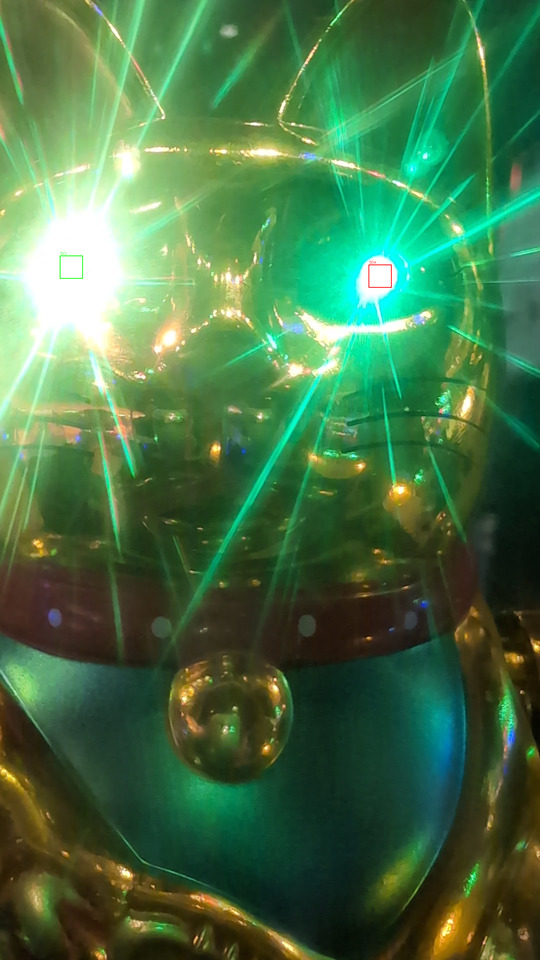
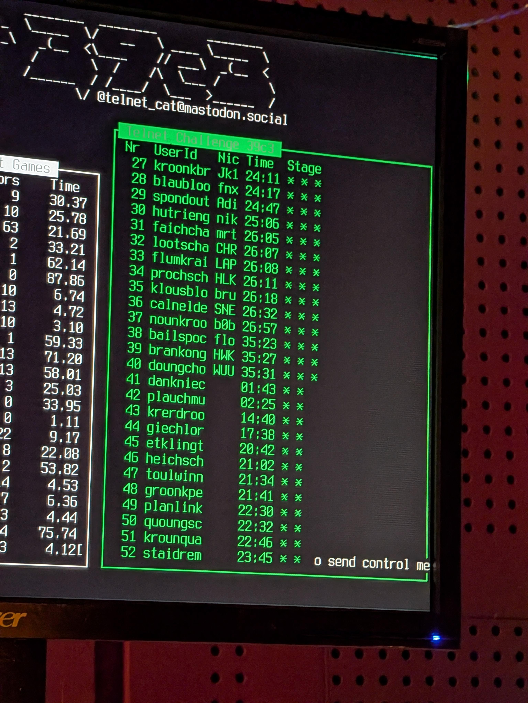
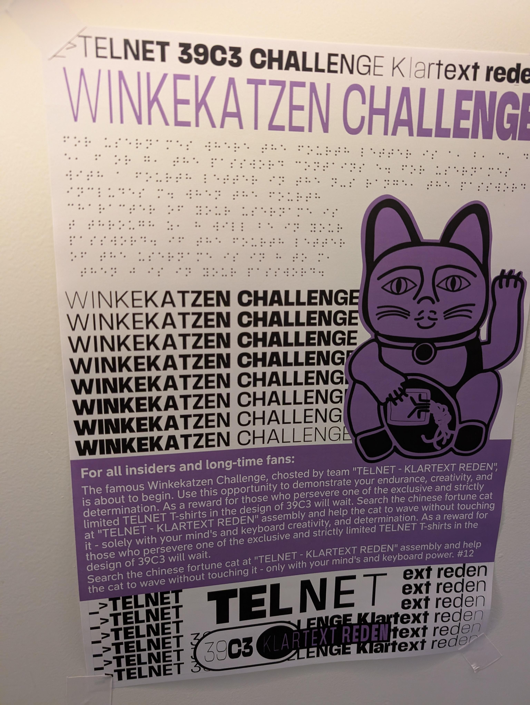
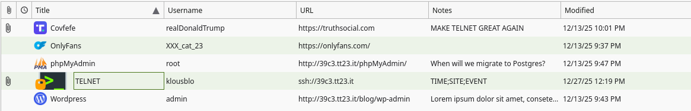
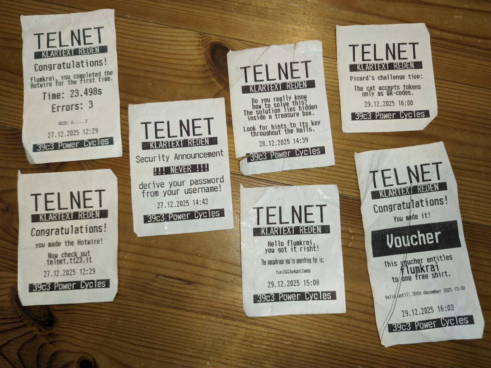

# Telnet challenge @ 39c3

We completed the telnet challenge this year and it was great fun again. This is a short write up for next year, as I struggled with stuff I should have known from telnet 38c3. This should help have a quicker start next year.

Parts of the telnet challenge, roughly 12-15 hours:

Overview:

1. Hotwire
2. Login with telnet: finding the password
   1. Finding BRAILLECONST
   2. Deciphering a I2C byte stream from a blinking eyes 6 minute cat video
3. Deciphering keepass.db
   1. Collect posters and decipher password hints braille
4. Connecting the wires
5. SSH tunnel and ISBN
6. QR-Code of secret

# Detailed

## 1. Hotwire 

Some people were really fast, I took 51s, 0 errors on fourth try. This requires an ISO 14443 RFID tag. After completing the challenge you received a preliminary username (I got `klousblo`) and got the address of the telnet server `telnet.tt23.it`.

## 2. Login with telnet

When entering `telnet telnet.tt23.it` you had to enter a username and a password. Once entering my username and a wrong password you got the hint that the password has the pattern along the lines of `UPPER(LEFT(SHA256(RFID | BRAILLECONST), 8))`. RFID was explained to be the first 4 bytes of your RFID serial number written as hex upper case. `|` is string concatenation.

`BRAILLECONST` was not specified further, this required some investigation. It turned out to be a 3D printed braille text in front of the cat which said something along the lines of "your first hotwire run time in ms plus catsecret". Catsecret was not further specified.

Catsecret turns out be part of a signal of the waving cat's eyes. It was transmitting a signal by blinking, the left eye was blinking in a constant repeating pattern, the right eye blinking every now and when. 

This is a I2C signal with a clock and a data signal. We recorded a static video of the entire sequence and implemented a parser which naively uses these two squares at precise coordinates to be the signal. It area is averaged and thresholded >= 128. Then I implemented a basic packet parser for I2C. Luckily the signal implemented the I2C start packet, and also an entire packet. This returned bytes from the I2C packet could directly be read as ASCII and included some hint for the previous challenge and the string "CATSECRET=23". 



Now, with enough info we could correctly provide the correct username and password to the telnet server. Providing this info the connectiot sends an (invalid) json containing two keys:

```json
{
  "pass": /39c3_[A-Z0-9]{8}/, 
  "file": "A9mimmf7S7UBAAQ... <161kB base64 data>"
}
```

The pass did not contain quotes, instead it was surrounded by slashes as in JavaScript.

The connection terminated afterwards. Three stars at this point:



## 3. Deciphering keepass.db

Decoding the base64 encoded file and `file`-ing it afterwards tells us it's a keepass database: `decoded.kdbx: Keepass password database 2.x KDBX`. It's of course encrypted with a master password. The password we obtained before did not work. So, now we need to find the next password. This involved a hunt throughout the congress for posters and then bruteforcing a password.



We knew about the poster hunt before, so we employed our friends to send us all posters of the telnet challenge even before starting the first part, therefore we had most of the required posters already. Deciphering them was another challenge however.

It turns out there are no really good online tools or libraries to OCR braille. At first we deciphered two posters manually, learning to read braille (surprisingly easy) visually in the process. Then to speed it up we used either https://angelina-reader.com/ or https://www.abcbraille.com/ to create a rough first version and then corrected it manually by reading the misspelled parts. This required some transformation, cropping and binarization of the braille text in order for readers to work at all.

The braille text included hints as follows:

```
If the first letter of the username is in a to g, then z is in
your password. for usernames with a second letter in the h to m
range  the password, includes d. if your username's third letter
falls between n and s, your password contains v. when the fourth
character of your username is t through z, 8 will be in your
password.
```

This is the first poster out of 16. Each hint appears on two posters though, therefore you did not need all posters, but needed at least 8. Translating all of these hints into a list of rules produced a list of 9 possible characters in the password. Why 9 despite the regex requiring 8? I assume either we made a mistake while reading/OCR'ing the posters or some of the posters contained mistakes (we saw corrections on some of them later on). We spent a lot of time trying to figure out why were 9 by proof reading everything, but everything seemed sound. It could have been intentional as well, not sure.

All the clues had the same pattern and did not give any information about the position of the characters. However, each clue does say that the password must contain that specific character. Therefore, we knew that with the 9 possible characters we have 9! ≈ 362k combinations. This sounds really easy for password cracking, however the keepass was (un)fortunately encrypted with Argon2id, which is really slow, even on GPU. 

At first we had only found enough posters to get 8 possible characters, which seemed doable without GPU. Thus I implemented a simple python script which tries loading the keepass database using [pykeepass](https://pypi.org/project/pykeepass/) with all passwords. This took roughly half an hour, but did not produce a result, even after many modifcations and error checking.

The next day we did find another poster and got to the 9 characters described at first. Also, we made progress at extracting the necessary information from the keepass database in order to run it on GPU via `john` and `keepass2john`. We needed to compile `john` however, as the arch linux version did not seem to support the newest 4.1 keepass database version. Running the 

```sh
./unique.py | ../compiled-john/run/john keepass.hash --stdin --format=KeePass-Argon2-opencl
```

`unique.py` being a small script to generate the permutations as there is no easy pattern to specify each letter appearing only once in john:

```py
from itertools import permutations

for perm in permutations("8UDVHKLCX", 8):
    print("39c3_" + "".join(perm))
```

This produced the password in around 10 minutes on a 3090 RTX GPU trying about 370 passwords per second. In comparison the python based approach was trying about 15 passwords per second on all CPU cores (i5-9600K).

This password was then used to decrypt the keepass database.


## 4. Connecting the wires

The KeePass database contained the following information:



The two attachments were an encrypted `epstein.pdf.zip` file and an encrypted (presumably ssh) private key. There was also a deleted entry for youtube.com with a link to a "Never Gonna Give You Up". The telnet entry contained this as a note:

```csv
TIME;SITE;EVENT
2025-12-25 16:46:12;ITO;Ground operations network latency exceeds acceptable thresholds.
2025-12-25 19:37:47;MEX;Check-in service unavailable due to backend connectivity issues.
2025-12-26 03:25:26;CDG;Access to airport data services was denied by the authorization layer.
2025-12-26 04:15:53;FRA;Hangar management system rejected the command due to invalid credentials.
2025-12-26 06:28:28;DXB;Baggage handling interface is not responding to scan requests.
2025-12-26 11:56:48;HND;Departure board update timed out while querying flight status.
2025-12-26 12:14:38;ICN;Flight plan database returned inconsistent routing information.
2025-12-26 15:57:28;NAN;Electronic gate control system reported an authentication error.
```

It also contained a hint:

```
Follow the signal through bundled lines—there you’ll find the string that grants access.
```

Took me a long time, I tried to guess various combinations of passwords for either file. But it turns out all but the note text and private key are not necessary. I received a hint: you had to use that information from the note to assign wires from wires 1-8 to A-H. There was another hint on the device `UTF or GTFO`.


So the solution was to sort the times using the airport codes by UTC time, and then using the first letter of each error code to assign a number to letter combination. Doing this you received a password for the private key printed by the receipt machine. 

## 5. Telnet via SSH & ISBN Title 

In order to login into the SSH server you had to create the public key first, as otherwise ssh does not try to only use the private-key: `ssh-keygen -y -f ~/.ssh/39c3-telnet > ~/.ssh/39c3-telnet.pub`. Afterwards you could try to login into the ssh server of the keepass database, however the server from the keepass database (39c3.tt23.it) rejected the private key and wanted the password. Instead you had to use the initial telnet server (telnet.tt23.it). This server however also rejected any ssh logins: `PTY allocation request failed on channel 2`. 

There was an initial hint in the telnet output once it was closed that that connection was insecure. This would lead you to guess that you had to connect to the telnet connection tunneled through ssh:

```bash
ssh -N -T -L 1080:localhost:23 telnet
```

Once you connected to the telnet via localhost `telnet localhost 1080` it asked you to name a book title given an ISBN. The trick is that you had to do it within 5 seconds of calling, which of course was really hard without scripting it.

This simple script retrieves the title given the ISBN and submits it automatically via telnet:

```py
#!/usr/bin/env -S uv run --with requests --script --python 3.10
from telnetlib import Telnet
import requests

def title_from_isbn(isbn: str) -> str | None:
    url = "https://openlibrary.org/api/books"
    params = {
        "bibkeys": f"ISBN:{isbn}",
        "format": "json",
        "jscmd": "data",
    }
    r = requests.get(url, params=params, timeout=10)
    r.raise_for_status()
    data = r.json()
    book = data.get(f"ISBN:{isbn}")
    return book["title"] if book else None

username = "klousblo"
password = ""

telnet = Telnet("localhost", 1080)
print(telnet.read_until(b"Username: ").decode())
telnet.write(username.encode() + b"\n")
print(telnet.read_until(b"Password: ").decode())
telnet.write(password.encode() + b"\n")
import time
time.sleep(1)
print(out := telnet.read_until(b"?").decode())
isbn = out.split()[-1].strip().removesuffix("?")

telnet.write(title_from_isbn(isbn).encode() + b"\n")
telnet.interact()
```

This gave you another clue, before closing the connection:

```
To make the cat wave present it with the following token: 0x80E2F511C22FEF83
```

Whatever that means.

## 6. Cats can read QR codes



Turns out, when you scan your RFID token in the reader, the receipt would give you another hint: the cat could only read QR codes. So I created a QR code with the number as a string and the cat started waving:


Thank you very much for the great challenge I had a lot of fun and it was again my highlight for the CCC!

