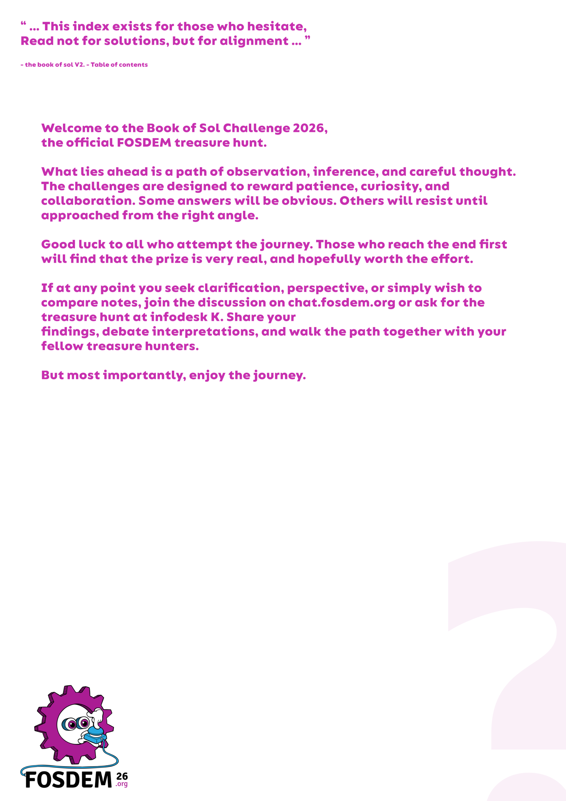
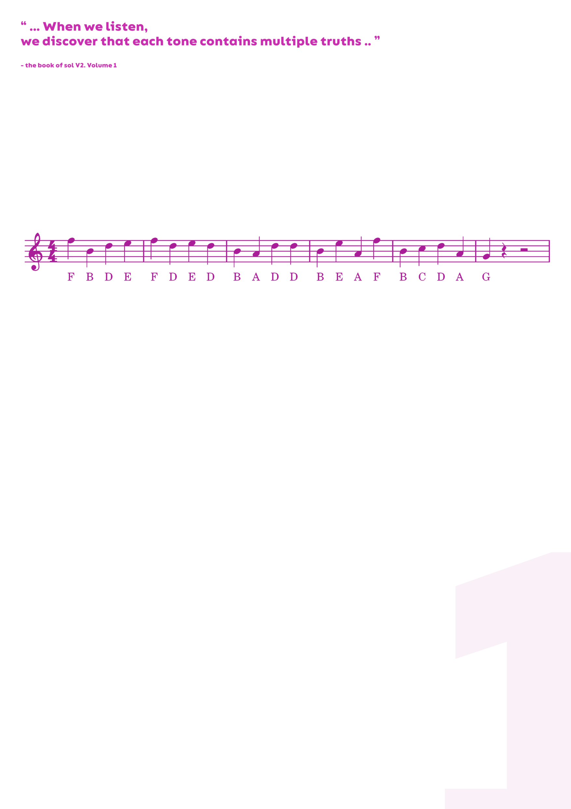
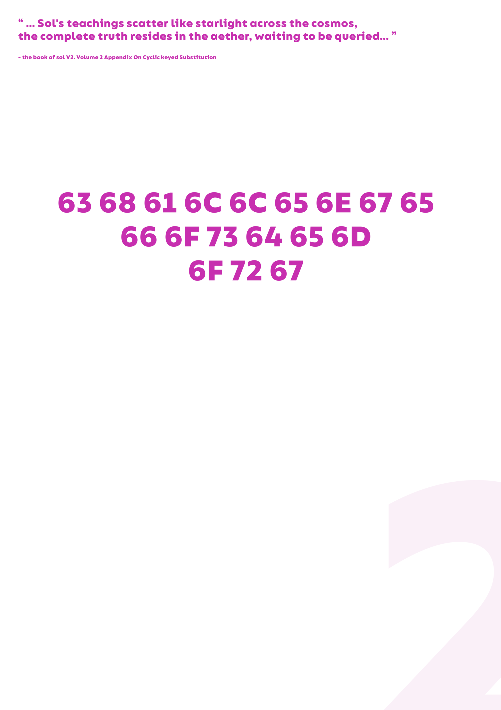
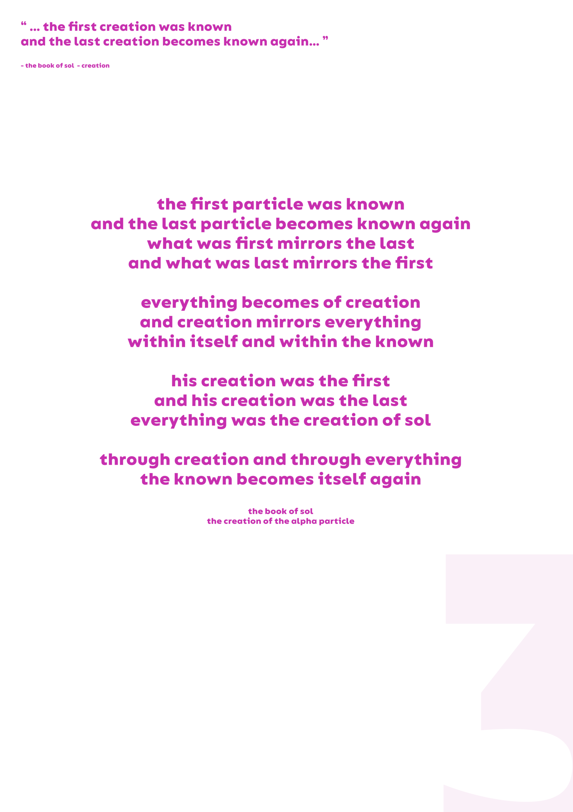
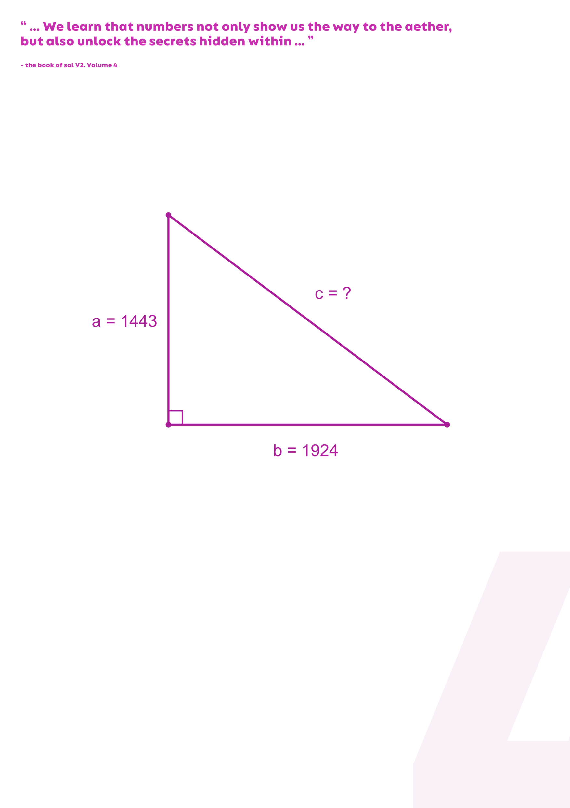
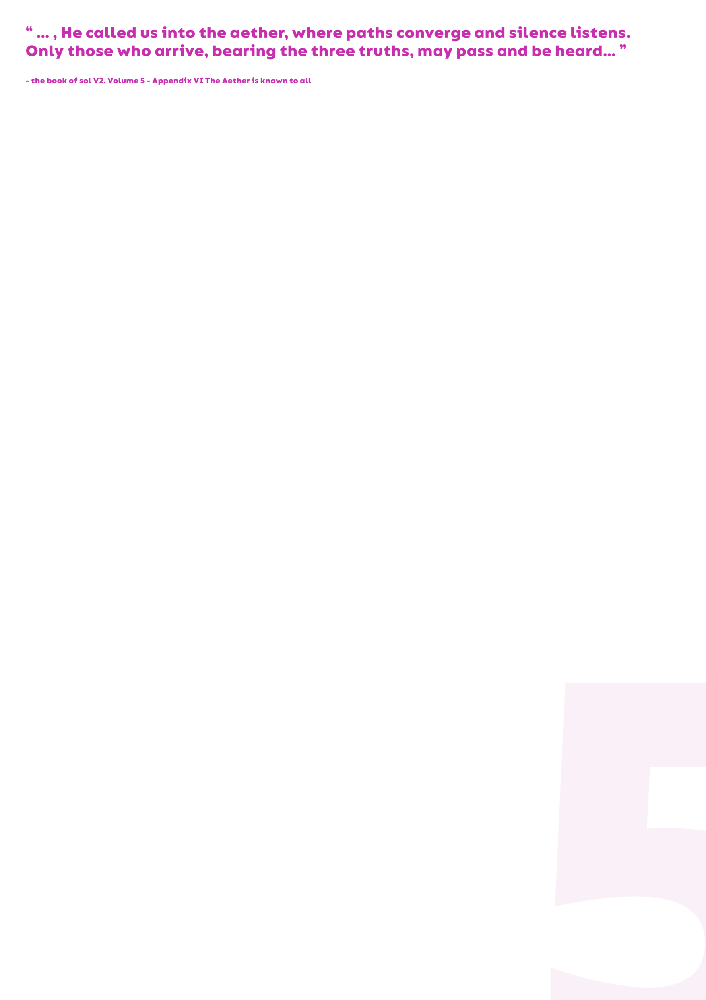

# FOSDEM 2026 - Treasure Hunt

We participated for the first time in FOSDEM and solved the treasure hunt as well. Here is a short write up about the challenges. We took about 4-5 hours to solve it, using the public hints from the matrix channel.

You were given [6 posters](https://fosdem.org/2026/news/2026-01-30-treasure-hunt/) (see below).

| | | |
|-|-|-|
|  |  |  |
|  |  |  |

## First steps: netcat, domain and port

Poster 2 (0 indexed) and poster 4 contained the most obvious clues. Solving poster 2 you get `challenge fosdem org` which obviously looks like a domain. And the triangle one produced 2405. Checking challenge.fosdem.org on a browser only gets you `We listen but we do not speak here`. A simple port scan with nmap without checking all ports did not show anything else. But at some point we checked port 2405 from the triangle poster and there you got this output:

```
❱ nc challenge.fosdem.org 2405
Welcome, traveler.
You stand before the Gates of Sol.

Knowledge here is not revealed, but assembled.
Each step narrows the path.
Each word carries weight.

Proceed with care.
Type 'exit' to leave.
Enter keyword #1:
```

Entering 3 keywords you either get through or not. Well this message reveals what poster 5 was hinting at, so nothing new, but now we know how to enter them. 

At this point we tried a few things. We found [The Book of SOL](https://www.goodreads.com/book/show/30658584-the-book-of-sol) by some Rowdy D. Solomon Jr. as the book of sol was mentionied everywhere. We did not find the text for that book, but we did find the testament of Mr. Solomon and put it into AI to see if any numbers are mentioned. At this point we thought that the keywords must be numbers because of the poster 4 `We learn that numbers not only show us the way to the aether, but also unlock the secrets hidden within.`. This did not turn out to be true, so not sure what it was hinting at. Well anyways, in the testament of Mr. Solomon there was a lot of talk about 36 devils, so we thought 36 must be one of the numbers. A this point we tried bruteforcing with 36, 2405 and all numbers between 1-500, but this did not work. 

For the notes we tried recording the notes and then playing them back to shazam. Shazam actually found a song called "Blessing" so we though this matches the religious theme. However, spotify showed us that song, but we were unable to play it, and it did not otherwise exist on the internet. 

We thought about other stuff, but we did not get any further on day 1 (Saturday).

On day 2 we checked the matrix channel for the treasure hunt and saw a couple of hints for the challenge. 

## Keyword 1 - Musical Notes

For the poster 1 (the notes) there were essential hints in the public matrix channel: musical cryptography, that it's solvable using wikipedia and "french", whatever that means. So now we checked all [music ciphers on wikipedia](https://en.wikipedia.org/wiki/Music_cipher), but none of these worked. Then we tried music cipher decoders such as [dcode.fr](https://www.dcode.fr/music-sheet-cipher) or [solfa-co.de](https://solfa-co.de/). Neither of these worked. Then we found [Muiscal Cryptogram](https://en.wikipedia.org/wiki/Musical_cryptogram) on wikipedia and saw the section "French". We looked at each other, yeah, this was perfect. Applying the table to our notes we get this, we have to pick one letter per row, as this is a cryptogram, it involves some guessing: 

```
F M T
B I P W
D K R Y
E L S Z
F M T
D K R Y
E L S Z
D K R Y
B I P W
A H O V
D K R Y
D K R Y
B I P W
E L S Z
A H O V
F M T
B I P W
C J Q X
D K R Y
A H O V
G N U
```


We guessed a bit manually and arrived at "FIRST KEYWORD IS", however, the last word was quite elusive:

```
A H O V
F M T
B I P W
C J Q X
D K R Y
A H O V
G N U
```

So instead of checking manually I downloaded an english word-list from [github](https://github.com/dwyl/english-words). and wrote a regex to find a matching word:

```py
import re
words = open("words.txt").read().lower()
print(re.findall(r"\b[ahov][fmt][bipw][cjqx][dkry][ahov][gnu]\b", words))
```

This produced `amicron` and `omicron`. The second one is a much more reasonable word, therefore we decided to stick with it. I suppose it would have been possible to find all 4 words in a similar way, but you would have had to implement some dijkstra path finding through all possible states as you cannot just regex all 4 words.

## Second keyword - Domain/DNS/Vigenere Cipher

The second keyword also had a hint on the matrix channel `You have to dig for it`. This was essential and revealed that the poster with the domain was still useful, we thoght that it only contained the domain. `dig`-ing for it revealed a TXT record for the domain `challenge.fosdem.org`: `cytmqviecxitp`. There was another hint in the matrix channel that each keyword had to be a valid english word and at the top of the poster it said `the book of sol V2. Volume 2 On Cyclic Keyed Substitution`. The last three words, `cyclic keyed substitution` obviously refer to something like the [Vigenere cipher](https://en.wikipedia.org/wiki/Vigen%C3%A8re_cipher). So the word is encrypted, but we don't have a key which is quite unfortunate. We looked for a possible key for some time, but no luck. Then I decided to try to just use the word list from the previous keyword and instead of trying different keys, to try different plaintexts based on the word list. It goes like this:

Take the 13 letter ciphertext `cytmqviecxitp`, take all 13 letter words from the word list, and see what key was used to obtain that word. If the key is repeating then it is very likely that we found the correct word. This has quite a few assumptions: 

* That the keyword is a single word (the previous challenge contained multiple) and nothing else
* That the key is shorter than the ciphertext/plaintext. If the key were as long as the ciphertext, we'd have something like a one-time-pad

Worth a try anyways, and despite this, the plaintext `authorization` produces the key `ceafceafceafc` and it was the only such occurence in all 400k words. No idea what `ceaf` means, but it's a short repeating key, so that it's really unlikely to be chance. So we lock in `authorization`.

## Third keyword - The poem: To bruteforce or not to bruteforce, that is the question?

With two keywords in hand, bruteforcing the third is really quite possible at this point. Therefore we wrote a small script using pwntools which opens the socket to `challenge.fosdem.org:2405` and which submits the words. The poem really did not make much sense to me, so after trying some words manually I decided to just try every word from the poem once with the script. Well, lucky me, `alpha` the last word of the poem worked out and we got to the next part!

## Fourth keyword - another poem?

After successfully entering all three keywords, you get this response:

```
The aether stirs. Only one more step:

I do not travel the paths of planets,
yet I leave the third in all directions.
I have no mass, no will of my own,
but I carry intent across the unknown.
Enter keyword #4:
```


My immediate idea was `photon`, however that did not work. Then I tried a bunch of other words `electron`, `neutrino`, `gluon`, `graviton`, `light`. Most of these did not make sense, as they have mass, but whatever. At the end I consulted some synonym dictionaries and some AIs and had a word list which I just let my script run through and it turned out `signal`  was the answer. Makes sense, I suppose.

## Completed!

Entering the last keyword confirmed that we have found the wisdom of sol and that we can claim the prize:

```
Enter keyword #4:
signal
You have found the wisdom of sol today. Find us at the infodesk K and claim your prize by using the following code ( take a screenshot of this window ) SOL-ac431244517e9daa4535bb35.
Transmission ended.
```

The author told us we were fifth to finish! Although we finished just before the last talk, so just in time. I really liked the first two challenges, the clues were a bit hard to guess but with the right clues it was great. Just like it should be I guess. The two poems/word puzzles were not quite my cup, I prefer technical puzzles I guess.
