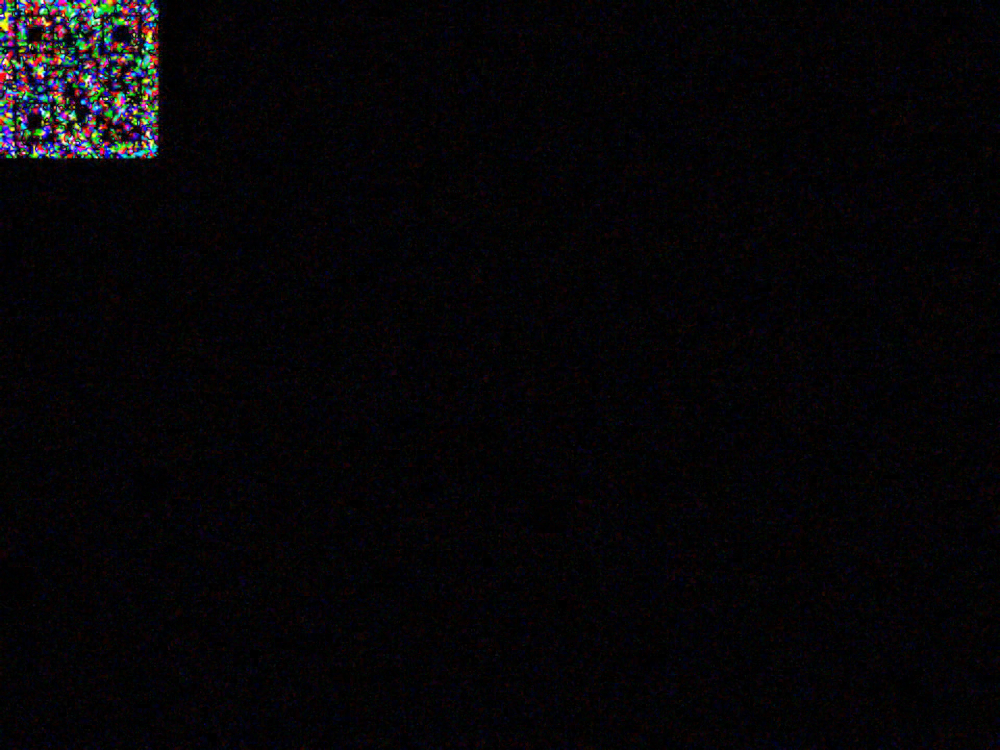
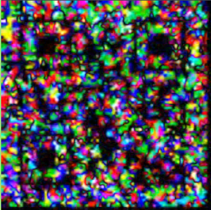
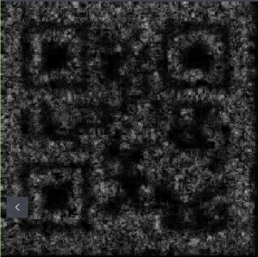
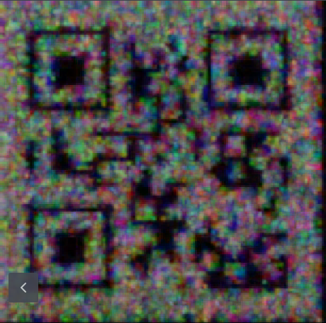
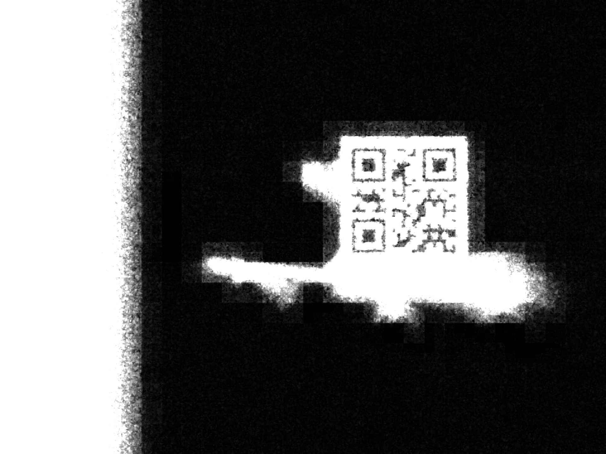

# Plaid Apple (misc)

This was the funniest challenge, you were given nothing but a link to a youtube video [https://www.youtube.com/watch?v=cAQyX-i4jyY] consisting of noise, which when played, produced some kind of discernable motion. This did not contain much security stuff, but it was a great puzzle, and had us sweating whether we'd make it: 10 minutes before the end of the 48h contest we had half of the flag, with the other half just barely not working out, would we make it? 


We watched the entire video, debating with my team mate that this is nonsense. How would you even start? I thought maybe this was some kind of steganography (hiding information in the high-frequency noise of the audio file), which I had done before in [StegoWAV](https://github.com/LiquidFun/StegoWAV). But this was a youtube video, with high compression; there was no high-frequency audio data to extract anymore. It cannot be anything which requires absolute precision, as both the audio and image data is compressed. This realisation was crucial, but it still seemed far off. So I went to read about some other problem.

I did return quite quickly to it though, I had remembered something I saw. And the problem spiked my curiosity. After rewatching the start I saw these blocks in the video again, which seemed to be out of place compared to the rest of the anime video. They did not appear in each scene, but in most scenes. Since the entire concept of the motion in the video is based on it playing as a video, all the motion must be encoded in adjacent frames changing. So I downloaded the video with `yt-dlp` and extracted all frames `ffmpeg -i apple.webm frame%05d.png`. Then I created the difference between the first few frames with the script [diff.py](./diff.py):



QR code only:



Lo and behold, there is something resembling a QR code in the corner in the difference between both frames! But it's not scannable, there is too much other noise and it's very unclean. Also there are hundreds of these QR codes, it seems like the entire video has these blocks appearing throughout the 7 minutes. So there is way too many for a single flag only, but whatever is encoded, I assume we must read the QR codes first. So I let the diff.py run the in the background, to create a difference between each frame for the entire video. Then I go to think of a way to reduce the noise.

First realisation is that QR codes appear for quite a few frames, and it seems like the actual data pixels do not change in the QR code, but the surrounding pixels to change. So it seems like we need to find areas of low noise and high noise within some range to extract the QR codes.

So with some gemini I create a script [avg.py](./avg.py), which selects a range of *diffs* and averages them. I tried a range of 3, 21, then 15 continuos images, changing stuff slightly. I made it black and white, it looked ok but was still not scannable.



But then I tried a range of 11 images and increased the contrast by normalizing the image values between 0.5 and 1.5, and then squaring the values. This makes the dark values darker and the bright values brighter. Then I also multiplied the entire image values by 2 and clipped the values back to 0.5 and 1.5. Then after scaling back to 0-255 the result is much more promising:



And first progress: this actually scans with my phone camera, the result is the letter **"B"**! Great news, so it seems we need to find all QR codes, and somewhere in there, there will be the flag, I hope? The avg.py program is quite slow, so I also add a sliding window option, so that the overlap is not 10 out of 11 frames, but only 5 out of 11 frames. I let this program run and create the next program to automatically extract the QR codes as I do not want to scan all ~2000 images by phone.  

The first version of the QR code reader uses the library pyzbar only, but this does not work: it does not find any QR codes. The QR codes are still barely scannable, so we need a more powerful library. Second version uses [qreader](https://github.com/Eric-Canas/qreader) in combination with pyzbar. The former finds the QR code using YOLO (machine learning), does some image preprocessing to increase contrast, the latter then reads the QR code. This worked quite well and it seemed to read the QR codes somewhat well. Then for the first version I parallelized this and added a tqdm progress bar in order to see progress of the scanning. However, on my machine this was slower than the non-parallelized version and took a couple of seconds per image, which was too long as we only had a 1-2 hours left.

At this point the avg11 frames were done and I let my QR code scanner loose, but it simply was too slow. Then I involved my team mate and transferred the necessary files over to his computer. There we started the parallelized version for all 2000 averaged images and... It was done in around 1 minute on his 24 cores + 4070. 

So we got a result something like that:

```
filename00012.png: B
filename00017.png: B
filename00022.png: B
filename00027.png: No QR found
filename00032.png: No QR found
filename00037.png: B
filename00042.png: No QR found
filename00047.png: B
filename00052.png: B
filename00057.png: B
filename00062.png: No QR found
filename00067.png: No QR found
filename00072.png: d
filename00077.png: d
filename00082.png: d
filename00087.png: d
filename00092.png: No QR found
filename00097.png: No QR found
filename00102.png: A
```

I never bothered to find where one QR code starts and another finishes, so each letter will likely appear many times. And as you can see the sometimes the QR codes were still not readable, especially later on. So I went on to try to improve the algorithm for averaging of the frames and my team mate tried to extract the flag from the string. He noticed that it started likely somewhere in the middle with `P`, `C`, `_`, `F` and somewhere later on there was a `}`, so this looked like the flag. We then focused on that range of frames between index 6400 and 7400. We had less than an hour left, he now also completely focused on this task. 

After some time he had part of the flag `PCTF{??spy_with_my_li?tle_`, (question mark QR codes did not scan) but I did not have much success with improving the QR codes. I tried various ranges for the images, from 3 to 21 pretty much everything. As well as various methods to manipulate the image: stretching the values even more, trying to set all pixels white which changed above some threshold, subtracting some constant value, using some opencv contrast enchancment method but nothing really produced anything better yet. 

We had less than half an hour left. At this point he had extracted most of the flag, but some parts in the middle were missing, it seems like these QR codes were particularly hard and were smaller. At the end there were some numbers and letters, but these QR codes were huge and were easy to read:

```
PCTF{?_spy_with_my_little_eye_p??s?s????e??f?v??ion_c32392f3e83c2741a5a3}
```

He saw my code and suggested to not do black and white conversion at the beginning, but do this after figuring out the averages. This seemed like a huge oversight on my part, I reduced the available information very early, which reduced the accuracy of difference detection greatly. After implementing this I essentially used the easiest contrast enchancmenet method yet... Simply take the average across all diff images in the range, then make it black and white (average RGB channels) and then multiply the color value by 3. This produced the highest contrast image yet:



This was the first letter of the flag: **"P"**. We had ten minutes left. I ran this on my laptop for the range of the flag and meanwhile I simply started scanning them by phone and telling him, he corrected the missing QR codes in his flag. With 5 minutes remaining we had this result, some QR codes still did not scan:

```
PCTF{i_spy_with_my_little_eye_persistence??f?vi?ion_c32392f3e83c2741a5a3}
```


4 missing letters, but these were part of the sentence, so he just guessed them. And would you believe it, with 4 minutes remaining we had submitted the correct flag:

```
PCTF{i_spy_with_my_little_eye_persistence_of_vision_c32392f3e83c2741a5a3}
```


What an amazing challenge! This was one the best puzzles I have done and it was also the closest submission I have ever done in any contest. Crazy stuff!
